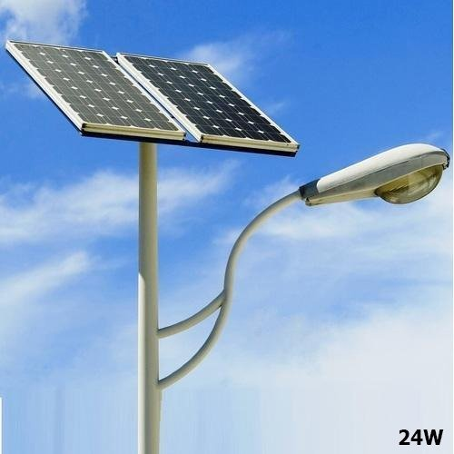
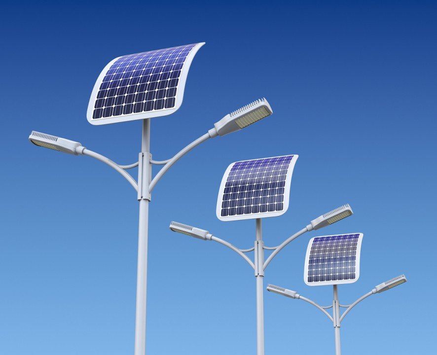
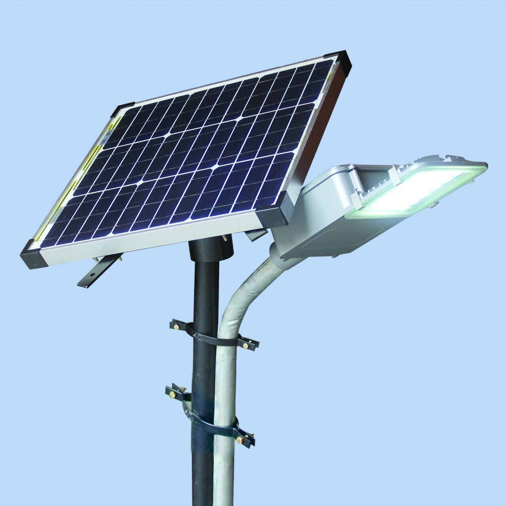
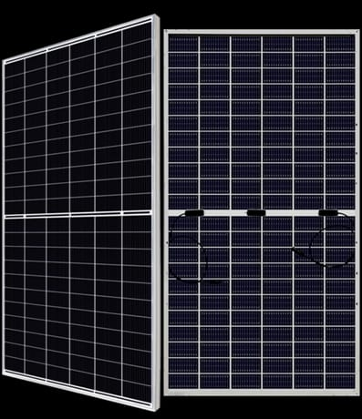
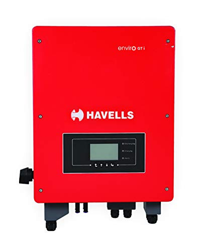
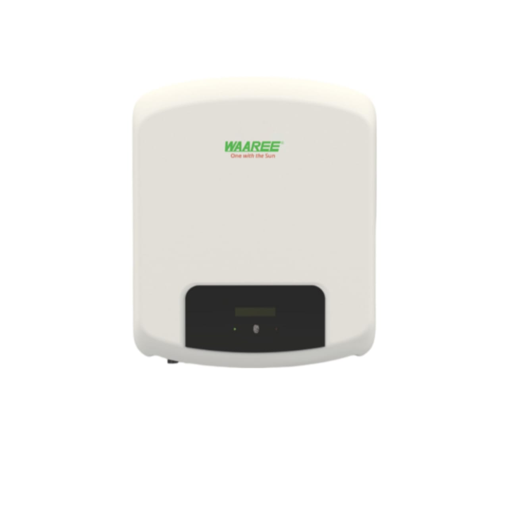
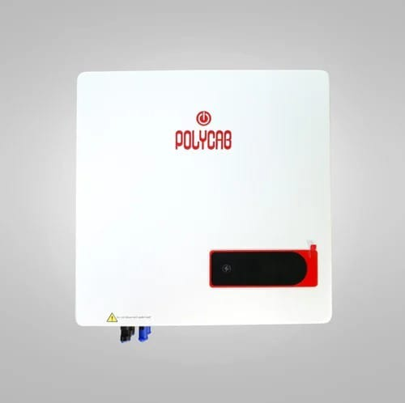
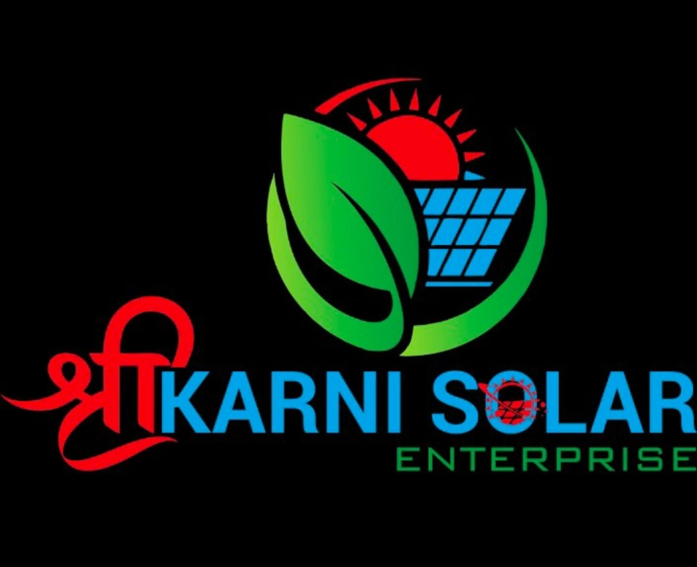
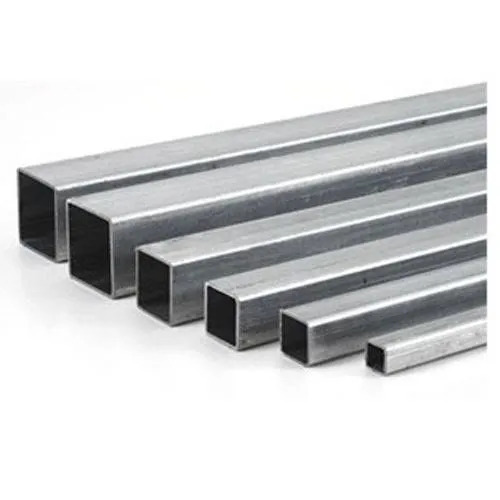

<!DOCTYPE html>
<html lang="gu">
<head>
<meta charset="UTF-8">
<meta name="viewport" content="width=device-width, initial-scale=1.0">
<title>Shree Karni Solar Enterprise</title>

</head>

<body>

<header>
<h1>Shree Karni Solar Enterprise</h1>

તમારા ભવિષ્યને સોલરથી ઉજળું બનાવો ☀️

</header>

<nav>
<a href="#">Home</a>
<a href="#about">About</a>
<a href="#services">Services</a>
<a href="#projects">Projects</a>
<a href="#contact">Contact</a>
</nav>

<section class="hero">
<h2>Save Electricity | Earn with Solar</h2>

Government Subsidy Available

<button onclick="window.location.href='#contact'">Free Quote મેળવો</button>
</section>

<section id="services">
<h2>અમારી સેવાઓ</h2>

☀️ Solar Panel Installation

🏠 Solar Rooftop System

🚜 Solar Water Pump

🔧 Maintenance & Service

</section>

<section id="projects">
<h2>અમારા પ્રોજેક્ટ્સ</h2>

Residential & Commercial Solar Installations

</section>

<section id="gallery">
<h2>અમારી ગેલેરી</h2>

અમારા રિયલ સોલર પ્રોજેક્ટ્સ

</section>

<section id="about">
<h2>અમારા વિશે</h2>

Shree Karni Solar Enterprise વિશ્વસનીય સોલર સેવા પ્રદાતા છે. અમે ઘર, બિઝનેસ અને ખેતી માટે સસ્તા અને ગુણવત્તાવાળા સોલર સોલ્યુશન આપીએ છીએ.

</section>

<section id="contact">
<h2>સંપર્ક કરો</h2>

📞 9274565072

📍 Gujarat, India

<form onsubmit="sendWhatsApp(); return false;">
<input type="text" id="name" placeholder="તમારું નામ" required> 
<input type="tel" id="phone" placeholder="મોબાઇલ નંબર" required> 
<textarea id="message" placeholder="તમારો મેસેજ"></textarea> 
<button type="submit">મોકલો</button>
</form>
</section>

<a class="whatsapp" href="https://wa.me/919274565072" target="_blank">💬</a>

<footer>

© 2026 Shree Karni Solar Enterprise

</footer>

</body>
</html>

